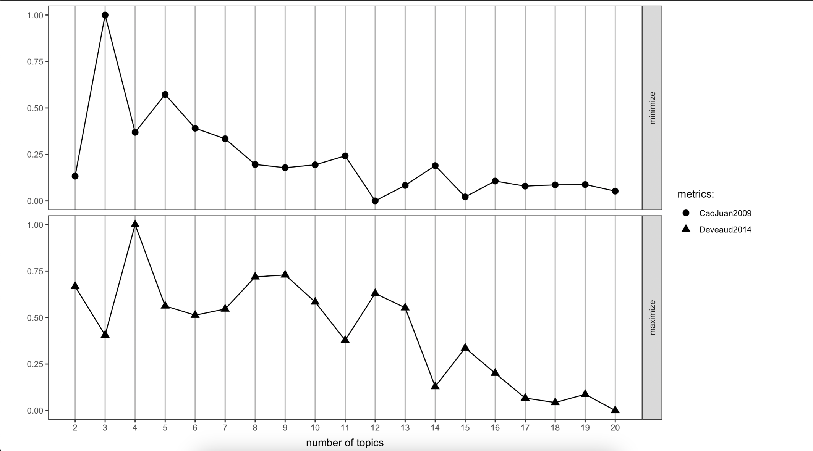
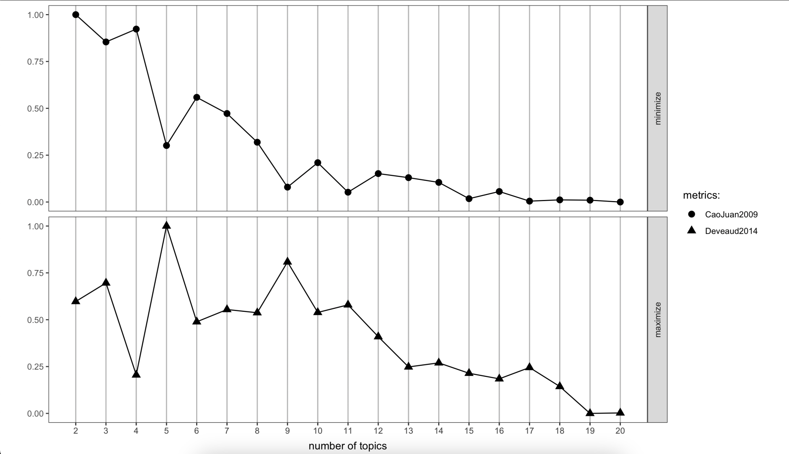
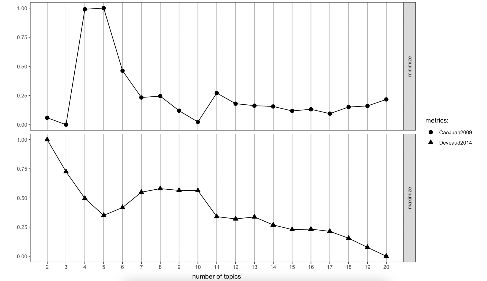
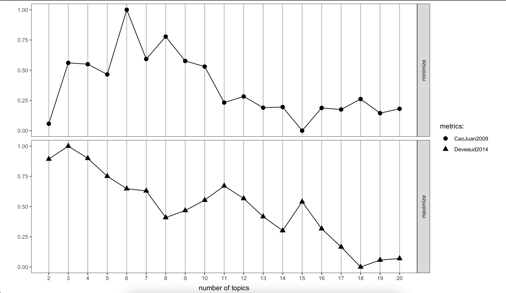
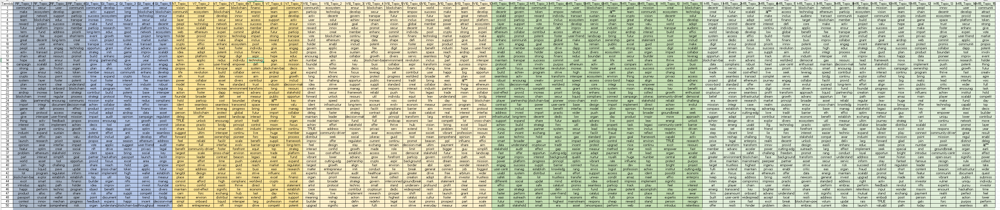
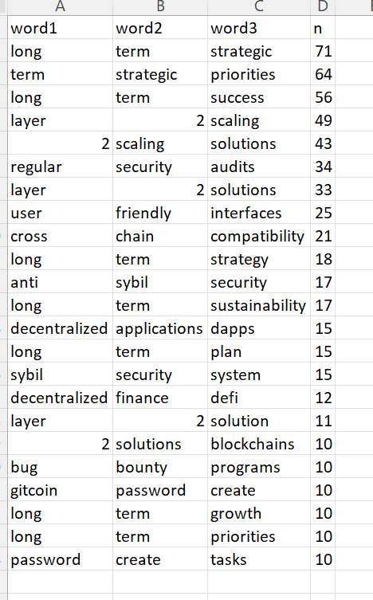
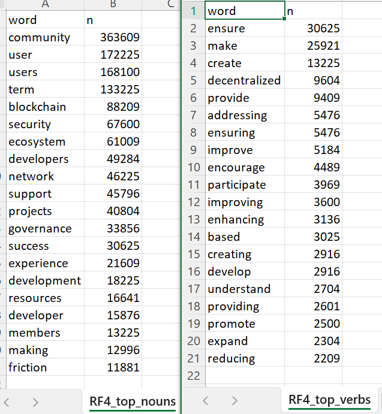

```{r setup, include=FALSE}
knitr::opts_chunk$set(echo = TRUE, warning = FALSE, message = FALSE, fig.align = "center")
```

## Sidenote

If you're ready to get started right away, you can skip straight to the "Getting Section". The tutorial consists of two main parts: "Part 1: Topic Analysis" and " Part 2: High-level Text Analysis" (ie. "n-grams" and "POS Tagging"). For intermediate students (ie. ideally students who have already worked on at least one other case study), feel free to skip directly to these sections.
---

## Introduction

This tutorial will walk you through the process we took in order to produce the text analysis for the Arbitrum JokeRaces. Our aim in this case study is to perform some text analysis on responses to something called a "JokeRace" (defined in the next section). We intend to capture all of the submissions so that we can analyze them to understand common themes across the responses by getting a feel for the amount of noise, performing a topic analysis to better understand what was said and performing some basic text analysis to extract the main thoughts of each race without having to read every post.

---

## Arbitrum

**Arbitrum** is a Layer 2 scaling solution for the Ethereum blockchain that aims to address the limitations of the Ethereum network, such as slow transaction speeds and high fees, particularly during times of high activity. It is designed to improve the speed of transactions, increase scalability, and reduce costs. The layer 2 Arbitrum (\$ARB) released their governance token a few months back. Now that they have both a product (The L2 Arbitrum) and a token. Plurality labs proposed one of two grant proposal designed to help with "sense-making" for the DAO, ie. creating an overarching mission. Our objective is to assist the DAO in setting an agenda that reflects the goals, mission and vision of the community.

---

## JokeRaces

A **JokeRace** is a survey platform that incentives participation by paying people for their opinions. People are prompted to respond to some query, for which the JokeRace then follows a schedule where submissions are open, and then closed while people vote. For each jokerace, approximately, 5,000 submissions were collected for a total of 20,000 responses.

There are four (4) jokeraces, each asking as a separate question about what the ARB DAO should do in the future:

1.  ArbitrumDAO Short-term Strategic Priorities (Reduce Friction) - 
0xbf47BDA4b172daf321148197700cBED04dbe0D58

2.  ArbitrumDAO Long-term Strategic Priorities (Growth and Innovation) - 
0x5D4e25fA847430Bf1974637f5bA8CB09D0B94ec7

3.  ArbitrumDAO Northstar Strategic Framework: Vision - 
0x0d4C05e4BaE5eE625aADC35479Cc0b140DDF95D4

4.  ArbitrumDAO Northstar Strategic Framework: Mission - 
0x5a207fA8e1136303Fd5232E200Ca30042c45c3B6

---

## Data Collection

Our initial job was to collect the dataset. We found the contract for each jokerace and then queried each of the transactions, for which we pulled out the data from each. We queried Dune Dashboards to extract all of the transactions for the 4 contracts in question:

``` sql
SELECT * FROM arbitrum.logs
WHERE contract_address IN 
(0xbf47BDA4b172daf321148197700cBED04dbe0D58,
0x5D4e25fA847430Bf1974637f5bA8CB09D0B94ec7,
0x0d4C05e4BaE5eE625aADC35479Cc0b140DDF95D4,
0x5a207fA8e1136303Fd5232E200Ca30042c45c3B6)
AND topic0 =
0xcd423cc1203c0af96b9b3d68d73b3064a69de2d14450bb7181c5e5df2132b358
```

---

## Data Preview

The final dataset can be found [here](https://docs.google.com/spreadsheets/d/17Evor8Xl5_Ks9OpifEQxARS6MfsvU1sUTM54tS1JK8c/edit#gid=705342398) in a spreadsheet. 

Below are the headings of the csv columns:

-   BlockTime - When the Submission hit the blockchain

-   Contract - Which Jokerace was this submission for

-   Address - The Wallet address of the submittor

-   Slug - an ID

-   URL - URL of the Submission

-   IsImage - Whether it had an image

-   Content - The Text submission

---

## Getting Started

In this tutorial, we will use the following R packages/ libraries:

```{r}
# Load packages
library(knitr)
library(kableExtra)
library(DT)
library(tm)
library(topicmodels)
library(reshape2)
library(ggplot2)
library(wordcloud)
library(pals)
library(SnowballC)
library(lda)
library(ldatuning)
library(flextable)
library(stringi)
library(tidytext)
library(dplyr)
library(purrr)
library(udpipe)
library(tidyr)
library(stringr)
library(readr)

```

If you need additional guidance getting set up, please refer to our earlier tutorials on getting using R Studio and R.
---

## Loading Data

The first step (after loading the libraries) is to load the data into the current R session.

``` {r}
# Load Data
propfinal <- readRDS("./propfinal.RDS")
```

The data is provided as an RDS file called "propfinal.RDS". RDS is an R binary storage format that can be directly read into the current session using the `readRDS()` function call.

When you check `head(propfinal)`, the output in console should look like below:
<add screenshot of dataset>

---

## Stopwords

Next, we can download common English "stopwords", save in a vector and add our own stopwords such as "arbitrumdao", "arbitrum", etc. These are words that we expect to see during our analysis and you can add new ones to filter out words that don't add new valuable information during when you are interpreting your results.

``` {r}
english_stopwords <- readLines("https://slcladal.github.io/resources/stopwords_en.txt", encoding = "UTF-8")
english_stopwords <- c(english_stopwords,c("arbitrumdao","arbitrum","project","arb","dao", "daos")) # Add new stop words here
```

---

# Part 1: Topic Analysis

---

## Topic Analysis

**Topic Analysis** consists of methods (ex. LDA, NMF, etc.) that are used identify and extract topics or themes from a corpus (a collection of documents or text data). It's a valuable tool for organizing, summarizing, and understanding large volumes of text. Latent Dirichlet Allocation (LDA) is a common technique for topic modelling and the method used in this case study. We performed Topic Analysis using LDA on each respective JokeRace to ascertain the common themes within each race.

// explain LDA and the DTM (refer to tutorial)

---
## Choosing Number of Topics

We will create a dataframe of dataframes called "contestdf" that allows us to do main tasks:

1. Keep track of which jokerace the topics belong to
2. keep track of the number of topics we are using for the analysis

Using a newer method of selecting the topics involving a mini-max approach across two metrics.

---

### ArbitrumDAO Short-term Strategic Priorities (Reduce Friction)

**Contract: 0xbf47bda4b172daf321148197700cbed04dbe0d58**

There were 1463 submissions and the DTM had a vocab of 763.



#### Interpretation
 To determine the optimal number of topics we simply choose a point that minimizes the top plot while maximizing the bottom plot so here we select 4 topics.

---

### ArbitrumDAO Long-term Strategic Priorities (Growth and Innovation)

**Contract: 0x5d4e25fa847430bf1974637f5ba8cb09d0b94ec7**

There were 1582 submissions and the DTM had a vocab of 818 (If you're unfamiliar with DTMs refer to the "Compute DTM" section).



#### Interpretation

Similarly, the optimal number of topics in this case is 5 topics since this choice minimizes the top plot while maximising the bottom plot.

---

### ArbitrumDAO Northstar Strategic Framework: Vision

**Contract: 0x0d4c05e4bae5ee625aadc35479cc0b140ddf95d4**

There were 1519 submissions and the DTM had a vocab of 746.



#### Interpretation

Based on the plots we can select 7 or 10 topics so we will create two separate dataframes (ie. V7 and V11) to keep track of both separately so we can compare the results easily.

---

### ArbitrumDAO Northstar Strategic Framework: Mission

**Contract: 0x5a207fa8e1136303fd5232e200ca30042c45c3b6**

There were 1506 submissions and the DTM had a vocab of 744.



#### Interpretation

Based on the plots we can select 11 or 15 topics. These are saved in the M11 and M15 dataframes in contestdf.

---

## Contest Dataframe

Now we are ready to create a dataframe called "contestdf" that contains six (6) simple dataframes that are identifiable by their "slugs" (ie. RF4, GI5, V7, etc.). Each dataframe contains a contract "Address", the "Name" of a given JokeRace, a "Slug" used to uniquely identify each dataframe, and the number of "Topics".

```{r}
contestdf <- do.call(rbind,list(
                                  data.frame(Address = "0xbf47bda4b172daf321148197700cbed04dbe0d58",Name = "Reduce Friction",Slug = "RF4",Topics = 4),
                                  data.frame(Address = "0x5d4e25fa847430bf1974637f5ba8cb09d0b94ec7",Name = "Growth and Innovation",Slug = "GI5",Topics = 5),
                                  data.frame(Address = "0x0d4c05e4bae5ee625aadc35479cc0b140ddf95d4",Name = "Vision",Slug = "V7",Topics = 7),
                                  data.frame(Address = "0x0d4c05e4bae5ee625aadc35479cc0b140ddf95d4",Name = "Vision",Slug = "V10",Topics = 10),
                                  data.frame(Address = "0x5a207fa8e1136303fd5232e200ca30042c45c3b6",Name = "Mission",Slug = "M11",Topics = 11),
                                  data.frame(Address = "0x5a207fa8e1136303fd5232e200ca30042c45c3b6",Name = "Mission",Slug = "M15",Topics = 15)
                            )
              )
```

The six (6) dataframes contained within contestdf are summarized below:

1. RF4 - Topic of that submission for the Reduce Friction Race using 4 topics
2. GI5 - Topic of that submission for the Growth and Innovation Race using 5 topics
3. V7 - Topic of that submission for the Vision Race using 7 topics
4. V10 - Topic of that submission for the Vision Race using 10 topics
5. M11 - Topic of that submission for the Mission Race using 11 topics
6. M15 - Topic of that submission for the Mission Race using 15 topics


---

## Save Topic Analysis Results

Since we effectively have to perform topic analysis six times (once for each dataframe RF4, GI5, etc.), we will use a main for loop and save the results in a variable located outside of the body of this for loop.

```{r}
# Save Topic Modelling Results
results <- as.data.frame(matrix(1:50))
names(results) <- "TermIdx"
```

Here we are creating one-column matrix containing 50 rows, converting it to a one-column dataframe and saving it in a variable called `results`. In the second line, we name the column heading, `TermIdx`.

---

## Setting up Main For-Loop

We set up the main for-loop to loop through each of the 6 rows in `contestdf` to keep track of which jokerace we are currently working on ie. when idx has the value of '1', it is referring to RF4, when idx has the value of '2', we are working on GI5, etc.

```{r}
for(idx in 1:nrow(contestdf))
{
  # Topic Analysis will go here
}
```

---

## Data Cleaning

If you examine the propfinal dataframe, you will notice that the data still needs cleaning. We need to remove HTML tags, stem words and duplicates as well as filter out low quality submissions to get high quality results. Below is the code that we used to creata a corpus while cleaning the data within the same breath. We will split up this code and explain it in the next couple slides.

```{r}
textdata <- propfinal$ContentParsed[propfinal$Contract==contestdf$Address[idx]]
textdata <- textdata[Encoding(textdata)!="bytes"]
textdata <- textdata[nchar(textdata)>40]
textdata <- textdata[!(textdata %in% names(which(table(textdata)>1)))]
textdata <- data.frame(Contest = contestdf$Name[idx],doc_id = 1:length(textdata),text = textdata)
corpus <- Corpus(DataframeSource(textdata))
```

---

### Extracting Textdata from Propfinal Dataframe

The first lines of code that we will add to the body of the loop are for extracting the text data from the "Content" column of `propfinal`. Recall that propfinal contains all the data while `contestdf` allows us to keep track of the respective JokeRace contracts and the number of topics to perform topic analysis. In the first line, we take all of the text data concerning this contract and store in an appropriately named variable named `textdata`. In the second line, we encode this data as "bytes".

```{r}
textdata <- propfinal$ContentParsed[propfinal$Contract==contestdf$Address[idx]]
textdata <- textdata[Encoding(textdata)!="bytes"]
```

---

### Filtering Low Quality Submissions and Removing Duplicates

For the purposes of thresholding, we used this rubric to get a feel for the character length required to create a meaningful contribution:

```         
This is 21 characters
This is 43 characters This is 43 characters
This is 84 characters This is 84 characters This is 84 characters This is 84 characters
```

We determined that we could safely filter out some of the noise by removing submissions containing less than 40 characters since it is difficult to say anything meaning with that amount of brevity. This occurs in the first line in the following code snippet. In the second line, we remove duplicates to further reduce noise. Rudimentary analysis using excel revealed that nearly 50% of the responses were duplicates.

``` {r}
textdata <- textdata[nchar(textdata)>40]
textdata <- textdata[!(textdata %in% names(which(table(textdata)>1)))]
```

---

### Creating Corpus

As mentioned earlier, the **corpus** contains the body of textual data that will be used for analysis. For explanation purposes, let us assume that idx has the value of '1' which refers to RF4" or contract `0xbf47bda4b172daf321148197700cbed04dbe0d58` for "Reduce Friction" and 4 topics. This code creates a dataframe containing three (3) columns called 'Contest', 'doc_id' and 'text'. This dataframe is then used to create the corpus that we will use to perform our topic analysis. The `Corpus` function from the `tm` text mining package does the work involved in converting the `textdata` into a `corpus`.

```{r}
textdata <- data.frame(Contest = contestdf$Name[idx],doc_id = 1:length(textdata),text = textdata)
corpus <- Corpus(DataframeSource(textdata))
```
  
---

## Preprocessing

Below is code to create a pre-processing chain to pre-process the text data stored in the corpus. Each step in the chain applies a specific text pre-processing operation from the `tm_map` function to clean and prepare the text data. The operations are self-explanatory. In order of the lines of code in the chain, we are performing the following operations on the corpus:

1. Converting everything to lowercase
2. Removing English stopwords
3. Removing punctuation without changing hypenated words (ie. preserving the dash in words like "high-speed") 
4. Removing numbers
5. Stemming ie. reducing words to their stems (base or root forms)
6. Trimming extra whitespace

```{r}
  # Pre-processing chain
  processedCorpus <- tm_map(corpus, content_transformer(tolower))
  processedCorpus <- tm_map(processedCorpus, removeWords, english_stopwords)
  processedCorpus <- tm_map(processedCorpus, removePunctuation, preserve_intra_word_dashes = TRUE)
  processedCorpus <- tm_map(processedCorpus, removeNumbers)
  processedCorpus <- tm_map(processedCorpus, stemDocument, language = "en")
  processedCorpus <- tm_map(processedCorpus, stripWhitespace)

```

The result of these operations creates clean and standardized text data that is now suitable for analysis.
---

## Compute DTM

A **document-term matrix (DTM)** is a numerical representation of text data where rows represent documents (ie. pieces of text) and columns represent terms (ie. words or tokens). Each cell in the matrix contains the frequency of a term's occurrence in a particular document. In the code below, the first line excludes words appearing in the text less than 5 times from appearing in the DTM. The second line creates the `DTM` from the `processedCorpus` and the last line prints the dimensions of the resulting `DTM` matrix in the console.

```{r}
  # compute document term matrix with terms >= minimumFrequency
  minimumFrequency <- 5
  DTM <- DocumentTermMatrix(processedCorpus, control = list(bounds = list(global = c(minimumFrequency, Inf))))
  # have a look at the number of documents and terms in the matrix
  dim(DTM)
```

---

## Removing Empty Rows

Empty rows in the DTm can cause issues in the LDA algorithm so we must remove them.

```{r}
  # due to vocabulary pruning, we have empty rows in our DTM
  # LDA does not like this. So we remove those docs from the
  # DTM and the metadata
  sel_idx <- slam::row_sums(DTM) > 0
  DTM <- DTM[sel_idx, ]
  textdata <- textdata[sel_idx, ]
```

---

## Latent Dirichlet Allocation (LDA) Algorithm

LDA is a topic modelling technique that is performed on a DTM created from a corpus. The first line extracts the number of topics from the current dataframe. Recall that each row in the contestdf contains a dataframe with a contract "Address", the "Name" of a given JokeRace, a "Slug" used to uniquely identify each dataframe, and the number of "Topics". The second line sets the seed for the random number generator. Setting the seed ensures that the LDA results are reproducible. In the third line, the LDA model is computed using the Gibbs sampling method using 5000 iterations and displaying progress outputs every 25 iterations.

```{r, eval=FALSE}
# number of topics
  K <- contestdf$Topics[idx]
  # set random number generator seed
  set.seed(9161)
  # compute the LDA model, inference via 5000 iterations of Gibbs sampling
  topicModel <- LDA(DTM, K, method="Gibbs", control=list(iter = 5000, verbose = 25))
```

---

## Examine and Store LDA Results

The first line calculates the posterior distributions of topics for the documents in the LDA model. The second line stores the temporary results in `result_t`. The third line assigns column names to the `result_t` dataframe. The column headings are created based on the slug, and the index of each topic. An example of a heading is "RF4_Topic_1". This naming scheme allow us to associate each word in a given column with specific topics and contests. For RF4, there will be 4 columns in total. For GI5, there will be 5 columns in total, etc. Line 4 appends the columns in `result_t` to `results`. Line 5 prints the value `idx` representing the current iteration so that we can have some feedback in the console when the loop is running for debugging.

``` {r, eval=FALSE}
# have a look at some of the results (posterior distributions)
  tmResult <- posterior(topicModel)
  result_t <- as.data.frame(terms(topicModel, 50))
  names(result_t) <- paste0(contestdf$Slug[idx],"_Topic_",1:contestdf$Topics[idx])
  results <- cbind(results,result_t)
  message(idx)
```

---

## Final Body of For-Loop

Combing the above code should result in the following code within the body of the for-loop.

```{r, eval=FALSE}
for(idx in 1:nrow(contestdf))
{
  textdata <- propfinal$ContentParsed[propfinal$Contract==contestdf$Address[idx]]
  textdata <- textdata[Encoding(textdata)!="bytes"]
  textdata <- textdata[nchar(textdata)>40]
  textdata <- textdata[!(textdata %in% names(which(table(textdata)>1)))]
  textdata <- data.frame(Contest = contestdf$Name[idx],doc_id = 1:length(textdata),text = textdata)
  corpus <- Corpus(DataframeSource(textdata))

  ########################################################################
  ## Process Text for Topic Modelling
  ########################################################################

  # Pre-processing chain
  processedCorpus <- tm_map(corpus, content_transformer(tolower))
  processedCorpus <- tm_map(processedCorpus, removeWords, english_stopwords)
  processedCorpus <- tm_map(processedCorpus, removePunctuation, preserve_intra_word_dashes = TRUE)
  processedCorpus <- tm_map(processedCorpus, removeNumbers)
  processedCorpus <- tm_map(processedCorpus, stemDocument, language = "en")
  processedCorpus <- tm_map(processedCorpus, stripWhitespace)

  ########################################################################
  ## Topic Modelling
  ########################################################################

  # compute document term matrix with terms >= minimumFrequency
  minimumFrequency <- 5
  DTM <- DocumentTermMatrix(processedCorpus, control = list(bounds = list(global = c(minimumFrequency, Inf))))
  # have a look at the number of documents and terms in the matrix
  dim(DTM)

  # due to vocabulary pruning, we have empty rows in our DTM
  # LDA does not like this. So we remove those docs from the
  # DTM and the metadata
  sel_idx <- slam::row_sums(DTM) > 0
  DTM <- DTM[sel_idx, ]
  textdata <- textdata[sel_idx, ]
  
  # number of topics
  K <- contestdf$Topics[idx]
  # set random number generator seed
  set.seed(9161)
  # compute the LDA model, inference via 1000 iterations of Gibbs sampling
  topicModel <- LDA(DTM, K, method="Gibbs", control=list(iter = 5000, verbose = 25))

  # have a look at some of the results (posterior distributions)
  tmResult <- posterior(topicModel)
  result_t <- as.data.frame(terms(topicModel, 50))
  names(result_t) <- paste0(contestdf$Slug[idx],"_Topic_",1:contestdf$Topics[idx])
  results <- cbind(results,result_t)
  message(idx)
}
```

---

## Create Master CSV containing Topics

Outside of the body of the for-loop,the `results` are saved in a csv named "TopicTerms.csv" that is stored in the same directory.

The csv should look like this:


Put this code outside the body of the main for-loop:

```{r, eval=FALSE}
# Output Topics
write_csv(results,"./TopicTerms.csv")
```

---

# Part 2: High-level Text Analysis

---

## n-grams

An **ngram** is just a number indicating the number of words in a sequence ie. 1-gram is 1 word, 2 grams are 2 words, 3 grams are 3 word sequences, etc. It is a continguous sequence of n items (ie. characters, words, etc.) extracted from a given text or sentence. We used the top n-grams under each JokeRace to perform a high-level analysis. For example, looking at trigrams (3-grams) for growth and innovation, the phrase "long term strategic", "layer 2 scaling" and "regular security audits" were some of the most frequenctly occurring, suggesting that's where Growth and Innovation should focus ie. scaling but in a secure manner.



---

### Top 1-gram

This code uses the `unnest_tokens` function from the `tidytext` package to create 1-grams (unigrams or single words) from `textdata`. It creates a column called `ngram` that containts the 1-grams. We filter out columns that contain missing values and split the ngrams into separate columns. For 1-grams this step isn't strictly necessary because the ngrams are single words but for consistency we include it here. Next, we do some cleaning to remove non-alphanumeric characters, empty rows and common English stop words. The `count` function is used to count the frequency of the words in each column and the `top_n` selects the top 20 1-grams based on their frequency.

```{r eval= FALSE}
# Top 20 unigrams
  top_20_unigrams <- textdata %>%
    unnest_tokens(ngram, text, token = "ngrams", n = 1) %>%
    filter(!is.na(ngram))%>%
    separate(ngram, c("word1"), sep = " ")%>%
    mutate(word1 = str_replace_all(word1, "[^[:alnum:]]", "")) %>%
    filter(word1 != "") %>%
    filter(!word1 %in% english_stopwords) %>%
    count(word1, sort = TRUE)%>%
    top_n(20)
```

We use similar code to create , 2-grams, 3-grams and 4-grams.

---

### Top 2-grams

```{r eval= FALSE}
# Top 20 bigrams
top_20_bigrams <- textdata %>%
  unnest_tokens(gram, text, token = "ngrams", n = 2) %>%
  filter(!is.na(gram))%>%
  separate(gram, c("word1", "word2"), sep = " ")%>%
  mutate(word1 = str_replace_all(word1, "[^[:alnum:]]", ""),
         word2 = str_replace_all(word2, "[^[:alnum:]]", "")) %>%
  filter(word1 != "" & word2 != "") %>%
  filter(!word1 %in% english_stopwords) %>%
  filter(!word2 %in% english_stopwords)%>%
  count(word1, word2, sort = TRUE)%>%
  top_n(20)
```

---

### Top 3-grams

```{r eval= FALSE}
# Top 20 trigrams
top_20_trigrams <- textdata %>%
unnest_tokens(gram, text, token = "ngrams", n = 3) %>%
filter(!is.na(gram))%>%
separate(gram, c("word1", "word2", "word3"), sep = " ")%>%
mutate(word1 = str_replace_all(word1, "[^[:alnum:]]", ""),
       word2 = str_replace_all(word2, "[^[:alnum:]]", ""),
       word3 = str_replace_all(word3, "[^[:alnum:]]", "")) %>%
filter(word1 != "" & word2 != "" & word3 != "") %>%
filter(!word1 %in% english_stopwords) %>%
filter(!word2 %in% english_stopwords)%>%
filter(!word3 %in% english_stopwords)%>%
count(word1, word2, word3, sort = TRUE)%>%
top_n(20)
```
  
---

### Top 4-grams

```{r, eval=FALSE}
# Top 20 fourgrams
top_20_fourgrams <- textdata %>%
unnest_tokens(gram, text, token = "ngrams", n = 4) %>%
filter(!is.na(gram))%>%
separate(gram, c("word1", "word2", "word3", "word4"), sep = " ")%>%
mutate(word1 = str_replace_all(word1, "[^[:alnum:]]", ""),
       word2 = str_replace_all(word2, "[^[:alnum:]]", ""),
       word3 = str_replace_all(word3, "[^[:alnum:]]", ""),
       word4 = str_replace_all(word4, "[^[:alnum:]]", "")) %>%
filter(word1 != "" & word2 != "" & word3 != "" & word4 != "") %>%
filter(!word1 %in% english_stopwords) %>%
filter(!word2 %in% english_stopwords)%>%
filter(!word3 %in% english_stopwords)%>%
filter(!word4 %in% english_stopwords)%>%
count(word1, word2, word3, word4, sort = TRUE)%>%
top_n(20)
```

---

## POS Tagging
**Parts of Speech (POS)** tagging involves determing the POS (ie. nouns, verbs, adjectives, adverbs, etc.) of each word in a sentence or text.

We performed POS tagging to identify the top nouns and the top verbs. We used nouns as a proxy for what "things" are important and verbs as a proxy for what "actions" are important.

For instance, looking at "Reduce Friction races:



We see that "community" and "users" are big focuses for the comments left by DAO members while they want to "ensure", "create", "provide" and "decentralize" some of the actions that should be taken.

---

Tokenisation involves breaking text into individual words or tokens. We use the `unnest_tokens` function to tokenise the `textdata` before we remove non-alphanumeric characters, empty rows and English stopwords.

```{r eval= FALSE}
# Tokenise text data and preprocess
  tokens <- unnest_tokens(textdata, word, text) %>%
    mutate(word = str_replace_all(word, "[^[:alnum:]]", "")) %>%
    filter(word != "") %>%
    filter(!word %in% english_stopwords)
```

We will use the `udpipe` package for POS tagging by downloading a pre-trained language model for English called "english-ewt".

```{r eval= FALSE}
# Load a model for 'udpipe'
udmodel <- udpipe_download_model(language = "english-ewt")
udmodel <- udpipe_load_model(file = udmodel$file_model)
```

The following code uses the pre-trained model to annotate the tokenise text dataset, `tokens`, convert the annotations to a dataframe and join these annotatoins back to `tokens`.
```{r eval= FALSE}
# Use the model to annotate the 'word' column
annotations <- udpipe_annotate(udmodel, x = tokens$word)

# Convert the output to a data frame
annotations_df <- as.data.frame(annotations)

# Join the annotations back to the original 'tokens' data frame
tokens <- tokens %>%
  left_join(annotations_df, by = c("word" = "token"), relationship = "many-to-many")
```

---

## Top 20 Verbs

```{r eval= FALSE}
# Top 20 verbs
top_verbs <- tokens %>%
filter(upos %in% c("VERB")) %>%
select(word) %>%
count(word, sort = TRUE) %>%
top_n(20)
```
 
---

Top 20 Nouns

    ```{r eval= FALSE}
    # Top 20 nouns
  top_nouns <- tokens %>%
    filter(upos %in% c("NOUN")) %>%
    select(word)%>%
    count(word, sort = TRUE) %>%
    top_n(20)
    ```

---

    ## Output CSVs
    ```{r eval= FALSE}
    # Create folder if it doesn't exist
  dir.create("./ngrams", showWarnings = FALSE)

  # Ngrams
  write_csv(top_20_unigrams, paste0("./ngrams/", contestdf$Slug[idx], "_top_unigrams.csv"))
  write_csv(top_20_bigrams, paste0("./ngrams/", contestdf$Slug[idx], "_top_bigrams.csv"))
  write_csv(top_20_trigrams, paste0("./ngrams/", contestdf$Slug[idx], "_top_trigrams.csv"))
  write_csv(top_20_fourgrams, paste0("./ngrams/", contestdf$Slug[idx], "_top_fourgrams.csv"))

  # Create folder if it doesn't exist
  dir.create("./pos", showWarnings = FALSE)

  # Parts of Speech
  write_csv(top_verbs, paste0("./pos/", contestdf$Slug[idx], "_top_verbs.csv"))
  write_csv(top_nouns, paste0("./pos/", contestdf$Slug[idx], "_top_nouns.csv"))
}
```
